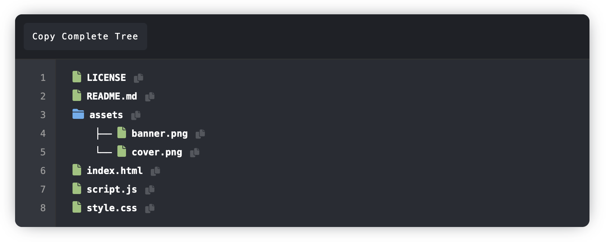

<p align="center">
  
</p>
<p align="center">  
  <b>With GitHubTree, visualize the directory structure of any <code>public</code> GitHub repository with a clean, terminal-like interface.</b>
</p>

----

**GitHubTree allows you to:**

*   **Explore:**  Easily browse the folder and file organization of a GitHub repo without cloning it.
*   **Copy Paths:**  Quickly copy the path to any file or directory with a single click.
*   **Copy Entire Tree:**  Copy the complete directory structure as plain text, perfect for documentation or sharing.
*   **Fast and Lightweight:**  Built with vanilla JavaScript, HTML, and CSS for optimal performance.
*   **No Authentication Required (for public repos):**  Uses the unauthenticated GitHub API, so you don't need to provide any credentials for public repositories.

<p align="center">
  
</p>

[**Try GitHubTree**](https://mgks.github.io/GitHubTree)

## How to Use

1.  **Enter Repository:**  Type the GitHub repository name in the format `username/repo` (e.g., `mgks/shaml`).
2.  **Enter Branch (Optional):**  Specify the branch name (defaults to `main`).
3.  **Click "Fetch Tree":**  The tool will retrieve and display the repository's folder structure.
4.  **Copy Individual Paths:** Click the copy icon next to any file or directory to copy its path to your clipboard.
5.  **Copy Entire Tree:** Click the "Copy Whole Tree" button to copy the complete structure as formatted text.

## Use Cases

*   **Quick Overview:**  Get a fast visual understanding of a repository's organization before deciding to clone it.
*   **Documentation:**  Easily generate directory listings for project documentation.
*   **Collaboration:**  Share the structure with others to discuss code organization.
*   **Learning:**  Explore how other projects are structured to improve your own coding practices.

## Rebuilding the Project

If you want to customize the tool or contribute, you can easily rebuild it:

1.  **Fork the Repository:** Create a fork of this repository on your own GitHub account.
2.  **Clone Your Fork:** Clone your forked repository to your local machine:

    ```bash
    git clone https://github.com/mgks/GitHubTree.git
    cd github-folder-structure
    ```
3.  **Make Changes:** Modify the `index.html`, `script.js`, or `style.css` files as needed.
4.  **Commit and Push:** Commit your changes and push them to your forked repository:

    ```bash
    git add .
    git commit -m "GitHubTree script update"
    git push origin main
    ```

5.  **GitHub Pages Deployment:** The project is automatically deployed to GitHub Pages using GitHub Actions.  Make sure GitHub Pages is enabled in your forked repository's settings (Settings > Pages).  It should be set to deploy from the `main` branch (or your default branch) and the root directory (`/`).

## Accessing Private Repositories (Advanced)

**Important Security Note:**  This tool, as deployed, *cannot* directly access private repositories due to security restrictions.  Exposing API keys in client-side JavaScript is a major security risk.

To access *your own* private repositories, you'll need to **fork this project** and modify it to use a GitHub Personal Access Token (PAT):

1.  **Create a PAT:**
    *   Go to your GitHub settings: [https://github.com/settings/tokens](https://github.com/settings/tokens)
    *   Click "Generate new token" (or "Generate new token (classic)").
    *   Give the token a descriptive name (e.g., "GitHub Folder Structure Viewer").
    *   Select the `repo` scope.  This grants access to your private repositories.  **Do not select any other scopes unless absolutely necessary.**
    *   Click "Generate token."
    *   **Copy the token immediately.**  You won't be able to see it again.

2.  **Add the PAT as a Secret:**
    *   Go to your forked repository's settings.
    *   Click "Secrets and variables" > "Actions".
    *   Click "New repository secret."
    *   Name the secret `GH_PAT` (or any name you prefer, but you'll need to update the `script.js` accordingly).
    *   Paste your PAT into the "Secret" field.
    *   Click "Add secret."

3.  **Modify `script.js` (Crucially Important):**
     You will need to modify the fetch calls to include the PAT in the request headers.  **Do this only in your forked repository, and never commit the PAT directly to the code.**

    ```javascript
    // ... (rest of the script.js) ...

    async function buildTree(repo, branch, path = '', level = 0, treeText = '', plainText = '') {
        const url = `https://api.github.com/repos/${repo}/contents/${path}?ref=${branch}`;
        const response = await fetch(url, {
             headers: {
                'Authorization': `token ${{ secrets.GH_PAT }}`, // Use the secret
             }
        });
    // ... (rest of the buildTree function) ...

    ```
    **Replace** `${{ secrets.GH_PAT }}` by your github token.

4.  **Deploy:**  Push your changes. GitHub Actions will automatically deploy your modified version to GitHub Pages.

**Warning:**  Never share your forked repository publicly if it contains your PAT, even in the Actions secrets. Anyone with access to your repository could potentially misuse your token. This method is only for accessing *your own* private repositories.

## Contributing

Contributions are welcome!  Please feel free to submit pull requests with bug fixes, improvements, or new features.

## License

This project is published under the MIT License - see [LICENSE](LICENSE) file for details or read [MIT license](https://opensource.org/licenses/MIT).

## Support the Project

**[GitHub Sponsors](https://github.com/sponsors/mgks):** Support this project and my other work by becoming a GitHub sponsor, it means a lot :)

**[Follow Me](https://github.com/mgks) on GitHub** | **Add Project to Watchlist** | **Star the Project**

<br />
